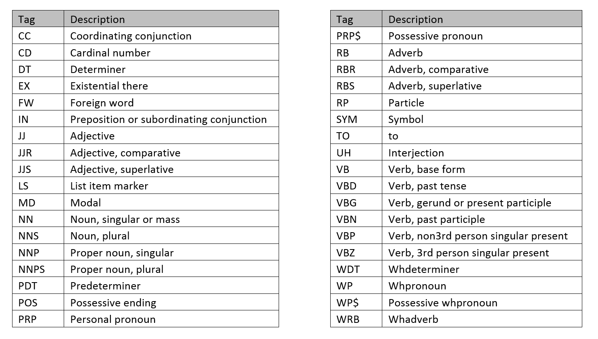

```{r results='hide', message=FALSE, echo=FALSE}
setwd("C:/Users/JL/Desktop/Study/Coursera/Johns Hopkins Data Science/10 capstone/CapstoneProject_NaturalLanguageProcessing")

library(tidyverse)
library(tidytext)
library(tm)
library(openNLP)

source("C:/Users/JL/Desktop/Study/Coursera/Johns Hopkins Data Science/10 capstone/CapstoneProject_NaturalLanguageProcessing/helper_functions.R")
```

# Data

Restricting ourselves to the "English" data, we have three documents. Twitter, Blogs, and News. Each file contains a string per line, where each line is an 'entry'. For all files, the length of these strings varies, however we should note that Twitter entries, 'tweets' are limited to 280-characters (140 prior to the increase)

# Exploratory Analysis

We can see some distinct differences between these documents with the following summary.

```{r cache=TRUE, message=FALSE}
base_files <- LoadFiles("data/en_US/")
```

```{r cache = TRUE}
SummaryDoc(base_files)
```
Blogs has the most words, yet the second-most entries, and with the largest mean number of words per entry. That is, the entries tend to have more words than any other document. However the high standard-deviation means they are more variable overall. Understandably, Twitter is the most restricted, however the ease of collection means we have the most entries. This restriction also reflects the smaller standard-deviation in number of words.

We can see these differences in distributions better with the following plot.

```{r cache = TRUE}
SummaryDoc(base_files, plot = TRUE)
```

We can also investigate the most frequently used words for each document.

```{r cache = TRUE, message=FALSE}

```

We can see that ################

Looking further at most frequent bigrams and trigrams, we create complementary plots for analysis.

```{r cache= TRUE}

```

We can see that ###############

Looking at the 'Term-Frequency / Inverse-Term-Frequency' (how "unique" a word is to that document) for each document, we have the following.

```{r cache = TRUE, message = FALSE}

```

We can see that #################

Lastly, if we inspect the Parts Of Speech for each document, we can gain a further insight into the types of writing that occurs in each. We can use the following table to understand each 'tag'.



Plotting the counts of each of these,

```{r cache= TRUE, message=FALSE}

```

We can see that ##################


# Goals

From calculating the above, we already have a lot of functions that are useful going forward. Especially so with the fact that one goal is to be able to apply this method to any folder of text documents. To present these clearly, the following goals are kept in mind

- Utilise functions to ensure reproducibility
- Employ efficient algorithms to counteract file size
- Calculate Markov Chain probabilities of unigrams, bigrams, and trigrams for modelling
- Create a function that uses the above to predict the enext word from a string of any length
- Create a function that can append a 'list of strings' to the probabilities matrix and 'update' it
- Research appropriate ways to measure accuracy of predictions