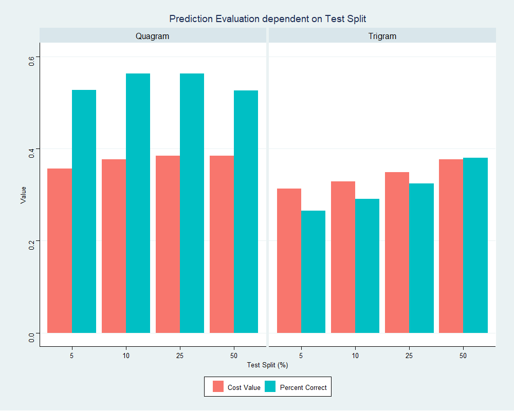
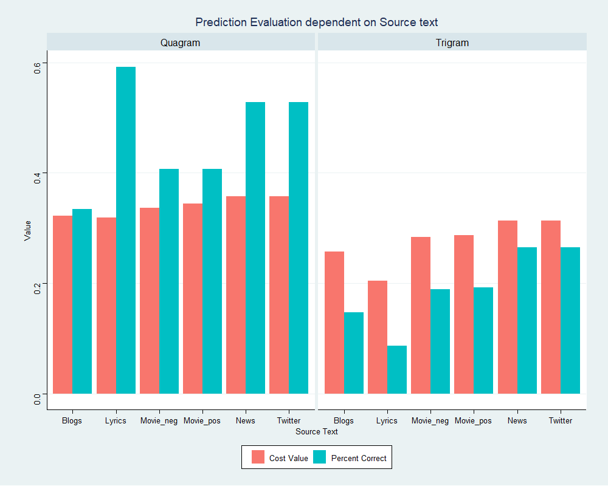

```{r setup, include=FALSE}
knitr::opts_chunk$set(echo = FALSE)
```


## Purpose and App
Our webapp ([App-link](https://jl17373.shinyapps.io/TextPredictiveModel_APP/)) Given a choice of source text, depth, and gamma. Our algorithm will predict the next word from a phrase.

It also lets the user see what words it is using to predict the next (the last three words).

#### How does it work?

A text is filtered and split into a collection of n-grams (word sets) up to $n=4$, and counted. 

Filters include both certain words but also frequency of n-grams. Some n-grams are ignored if they do not appear enough times in the source text.

The counts of each n-gram, and at what depth a prediction is made, are what decides the probability assigned.

The algorithm first tries to predict using its largest n-grams before trying with smaller n-grams. (It's easier to predict the next word given a phrase over one or two words).

This is done using Markov Chains and an implementation of a Katz Back-Off model (see next slide). Probability is "fine-tuned" using Discounting, Smoothing, and approximation methods.

The choice of 'Gamma' affects how important predictions at 'lower-depths' are. Larger gamma, the larger the probability of 'lower-depth' predictions. This is more evident when looking at the 'table of predictions' on the web-app.


## Summary of algorithm

    • Take phrase, find last three words

    • Find matches, using three words, at highest level (n = 4)

    • Make guesses at n = 4 

      • Find matches, using two words, at n = 3 *
  
      • Make guesses at n = 3  
  
        • Find matches, using one word, at n = 2 * 
    
        • Make guesses at n = 2 
    
          • Make guesses at n = 1 *
      
    • Return top prediction

    • Return Plot of top 10

    • Return Table of all predictions

    * Minus matches previously made
    
Probability assigned to each prediction decreases further down the algorithm that the prediction is made.

## Evaluating Accuracy

We have two metrics to evaluate our prediction algorithm

- The percentage of correct predictions
- A Cost function that penalises two outcomes
  - Incorrect predictions with high probability
  - Correct predictions with low probability

$$C = \frac{1}{n}\sum_{i=1}^{n}\ln(|\alpha_i - P_i|)$$
where $\alpha_i = 1$ if the prediction is correct, else $\alpha_i = 0$,

$n$ is the total number of predictions made,

and $P_i$ is the probability assigned to that prediction.

**A "best" model will have a high Percentage Correct and a  low Cost.**

## Evaluation

We took the a 25% sample of the 'Twitter' source data to inspect the effect of test split on prediction accuracy, and an insight into model performance.

```{r, echo=FALSE}
   
```

- Quagrams (ngram = 4) lead to more accurate predictions regardless of split. This is expected.
- 'Cost' lowers with larger training set (smaller test set). This is indicative of improved probability assignment by the prediction algorithm


## Evaluation

It is expected that accuracy of predictions relates directly to the source text.We used a variety of texts from multiple sources to inspect their effects on prediction accuracy.

Ultimately, we are seeing a correct prediction percentage within the range 0.15 ~ 0.4 across sources and depth.

```{r, echo=FALSE}
   
```

- Quagram prediction persistently produces more correct predictions
- The depth available to predict has a significant impact on prediction accuracy. "Lyrics" have the most striking example.
